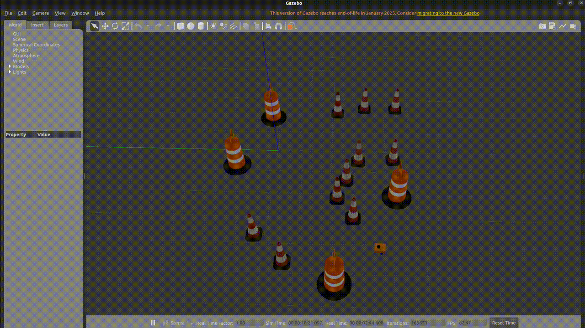

# 🤖 MySimRobot (ROS 2 Humble Simulation)

This project is a differential drive mobile robot simulation built using ROS 2 Humble on Ubuntu 22.04.5.  
It includes simulation, teleoperation, SLAM-based mapping, and autonomous navigation using Nav2.

---

## 🚀 Features

- Gazebo-based robot simulation  
- Keyboard teleoperation  
- SLAM (online asynchronous mapping)  
- Autonomous navigation (Nav2)  
- RViz visualization support  
- Map saving capability  

---

## 🛠️ Installation & Build

After cloning the repository, run the following commands **once**:

```bash
colcon build
source ~/.bashrc
```

> Rebuild is only required if you modify the source code.

---

## ⚙️ Environment Setup

For **every new terminal**, run:

```bash
source install/setup.bash
```

For the full terminal command guide, including Nav2 startup, route saving, and route replay, see:

```text
KULLANIM_KOMUTLARI.md
```

---

## 🧪 Running the Simulation

### 1. Launch the Robot in Gazebo

```bash
ros2 launch mysimrobot launch_sim.launch.py
```

To launch in an empty world:

```bash
ros2 launch mysimrobot launch_sim.launch.py world:=src/mysimrobot/worlds/empty.world
```

---

### 2. Teleoperate the Robot

Open a new terminal:

```bash
ros2 run teleop_twist_keyboard teleop_twist_keyboard
```

---

### 3. Start SLAM (Mapping)

```bash
ros2 launch mysimrobot online_async_launch.py use_sim_time:=true
```

---

### 4. Start Autonomous Navigation (Nav2)

```bash
ros2 launch mysimrobot navigation_launch.py use_sim_time:=true
```

---

### 5. Run RViz

```bash
rviz2
```

⚠️ **Important:**

- Set **Fixed Frame → `map`**
- Add **RobotModel** for proper visualization

---

### 6. Save the Map

```bash
ros2 run nav2_map_server map_saver_cli -f ~/maps
```

---

## 🎥 Demo

### Gazebo Simulation  


### RViz Visualization  


### YouTube Demo  
[](https://youtu.be/pnQI-DLz0Y8)

---

## 📌 Notes

- Ensure all nodes use `use_sim_time:=true` during simulation  
- Run each component in a separate terminal  
- RViz must be properly configured for correct visualization  
